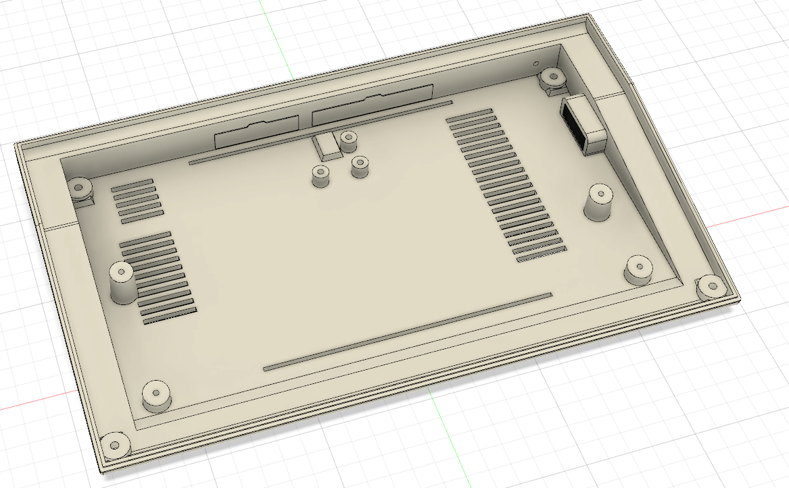
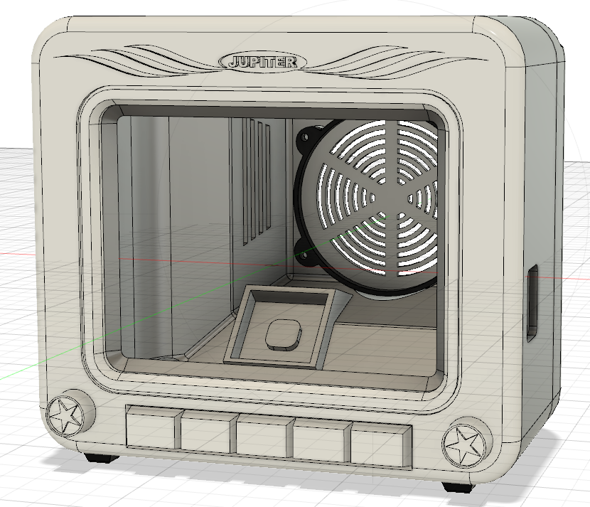

**[ZURÜCK](README.md)**
# <a name="druck">Design und Druck der Bauteile</a>
## 3d-Modell
Das Modell wurde mit Autodesk Fusion 360 erstellt. 

**Bitte beachten**: Das Modell des Computergehäuses und die darin verbaute Elektronik sind dafür 70% der Originalgröße ausgelegt. Die STL-Dateien geben das bereits wieder; in den Fusion-Dateien (.3mf) hat das Gehäuse noch die Originalgröße. Wer das Modell in Originalgröße nachbauen möchte, muss die Pfosten für den Tastaturcontroller anpassen und die Tastaturplatine entsprechend skalieren, bevor sie geätzt wird. Außerdem muss gegebenenfalls die Position der Resetschalter-Halterung angepasst werden.

## Drucke
Die aus Fusion 360 exportierten STL-Dateien werden mit Ultimaker Cura 4.x druckfertig gemacht -> Das Projekt enthält gcode-Dateien für Creality Ender 3.

Gedruckt wird mit PLA (Gehäuse, Tastaturschablone, Resetschalter) und TPU-Filament (Tastaturmatte). 

Für den VZ 200 nehmen wir Weiß (Gehäuse), schokoladenbraun (Tastaturabdeckung) und eine beliebige TPU-Farbe für die Tastaturmatte (gummiartig).

**[ZURÜCK](README.md)**
