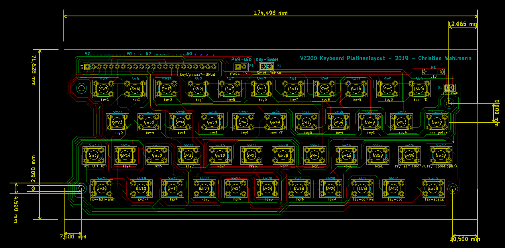

**[ZURÜCK](README.md)**
# <a name="platinendesign">Platinendesign und -produktion</a>

Eigenes Platinenlayout mit Dip-Schaltern (6mm; Höhe über Platine: 4,5mm; 4 Füße), die über eine Gummi-Tastaturmatte betätigt werden.
Tastaturcontroller: KEYWARRIOR24_8_MODUL_KW24_8_MOD

Das Layout kann, als Zip mit GBR-Dateien, über diverse Anbieter in kleiner Stückzahl (meist >= 3) produziert werden. 

Gute Erfahrungen haben wir mit [Aisler](https://aisler.net) gemacht. 

**[ZURÜCK](README.md)**
