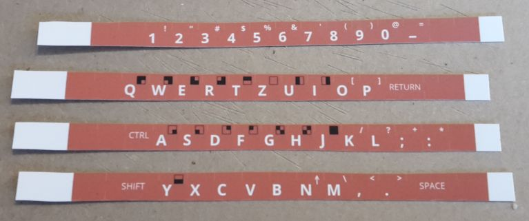
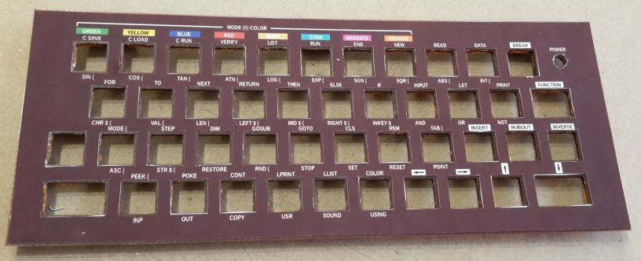
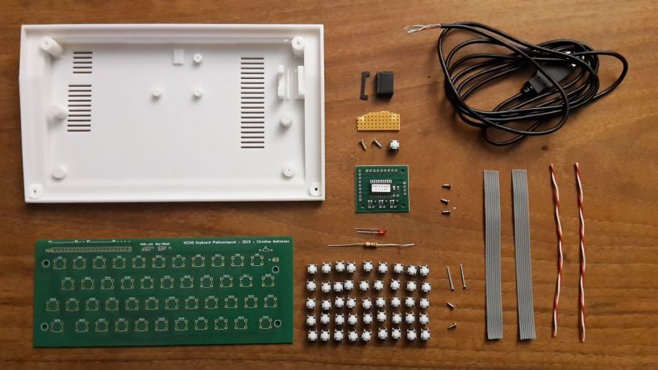
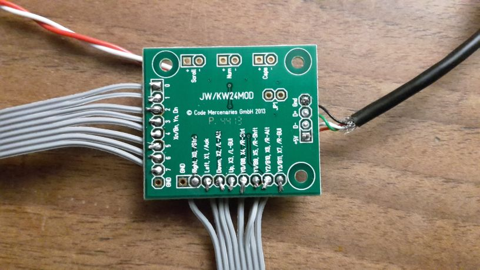
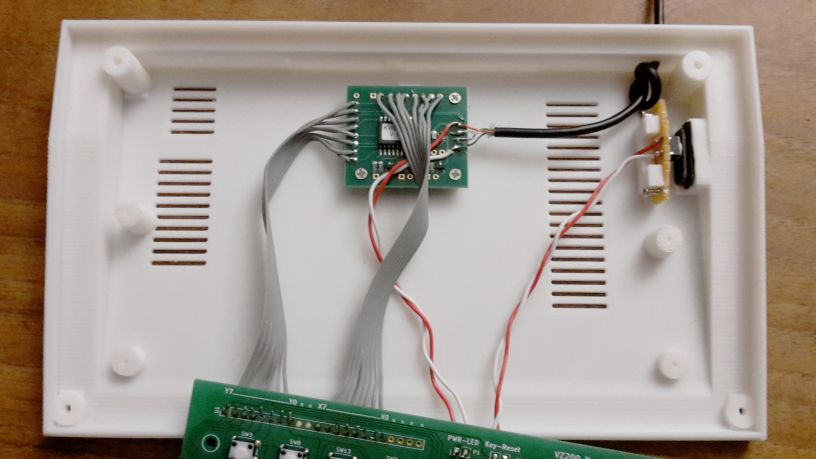
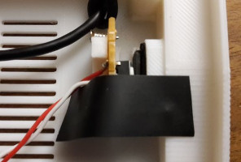
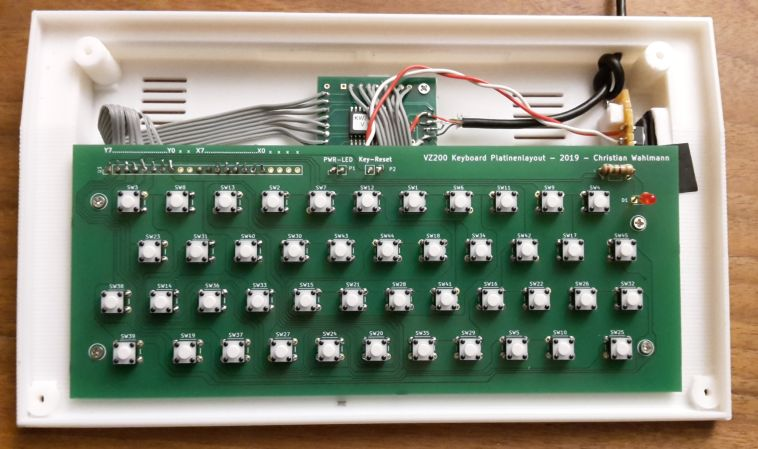
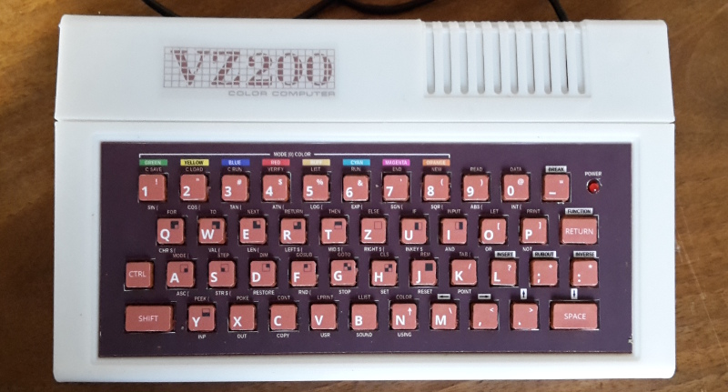

**[ZURÜCK](README.md)**
# <a name="zusammenbau">Zusammenbau des VZ200</a>

Das Chassis beherbergt eine funktionierende Tastatur mit Power-LED und Reset-Taster.

Bei einer Größe von 70 Prozent gegenüber dem Original-Rechner passt der Raspberry Pi nicht mit ins Gehäuse. Dieser wird deshalb in
den Monitor integriert. Der VZ200 wird als USB-Tastatur an den Raspberry angeschlossen. 

(Ein Raspberry-Zero würde in das Gehäuse passen, es muss jedoch getestet werden, ob dieser für den Emulator genügend Rechenpower liefert.)

## benötigte Bauteile

| Bauteil | Beschreibung |
| ------- | ------------ |
| Gedruckte Teile | Boden, Abdeckung hinten, Tastatur (Rahmen, Schablone, Tastenmatte), Resetschalter + Klammer |
| Gedrucktes Logo | klare, selbstklebende, transparente A4 Polyesterfolie für Tintenstrahldrucker (z.B. von Photo Paper Direct PPD-39-20) |
| Gedruckte Tasten auf Vinylfolie | weiße, matte, selbstklebende A4 Vinylfolie für Tintenstrahldrucker (z.B. von Photo Paper Direct PPD-38-10) |
| Gedruckte Tastaturschablone auf Vinylfolie | weiße, matte, selbstklebende A4 Vinylfolie für Tintenstrahldrucker (z.B. von Photo Paper Direct PPD-38-10) |
| Modellfarbe für Tasten | EMAIL COLOR von Revell, Matt 35 (Hautfarben) und Matt 85 (Braun) |
| Tastaturplatine | mit Hilfe des Platinendesigns kann die Platine über diverse Anbieter gefertigt werden |
| Tastaturcontroller | ein USB-Keyboard-Controller mit vordefinierter Belegung: KEYWARRIOR24_8_MODUL_KW24_8_MOD |
| USB-Kabel | USB-Kabel mit Stecker und Litzen zum Einlöten |
| 45 Drucktaster | Bestückung der Tastaturplatine, 6x6 mm |
| 1 rote LED | die Power-LED, 3mm |
| 1 Widerstand | 150 Ohm (braun / grün / braun) |
| ein Stück Lochplatine | für den Drucktaster des Resetschalters, Lochabstand 2.54 mm |
| 1 Drucktaster | für den Resetschalter, 6x6 mm |
| 2 x Rot-Weiße Litze ca. 10 cm | für den Resetschalter und die Power-LED |
| 2 x 8-adriges Flachbandkabel ca. 10 cm | z.B. aus alten IDE-Flachbandkabeln, für die Verbindung Tastaturcontroler -> Tastaturplatine |
| ein Stück Isolierband | Abschirmung von Reset-Schalter und Tastaturplatine | 
| 7 kurze Schrauben M2 5mm | Befestigung von Tastaturplatine und -Controller |
| 2 kurze Schrauben M2 8mm | Befestigung der Reset-Schalter-Platine |
| 2 kurze M2 5mm und 2 lange M2 20mm Schrauben | Zusammenbau des Gehäuses |

## hintere Gehäuseabdeckung mit Logo versehen

Das gedruckt Logo muss wie abgebildet auf der hinteren Gehäuseabdeckung angebracht werden.

## Tastatur zusammenbauen
Benötigt werden die gedruckte Tastaturmatte, Modellfarbe und die gedruckten Tastenaufkleber.

Die Tasten der Matte müssen zunächst mit der Farbe (Matt 35, Hautfarben) mit einem Pinsel grundiert und dann
mit (Matt 85, Braun) gestrichen werden. Es sollten nur die Tasten selbst bemalt werden, damit die Matte gut zwischen Platine und Tastaturschablone passt und die Tasten leichtgängig bleiben. Ein Färben mit Sprühlack ist nicht zu empfehlen.

Die Aufkleber werden nun geschnitten.

Wichtig ist: damit die Tasten einen runden Eindruck machen, sollten die Ecken der Aufkleber diagonal angeschnitten werden.

Die geschnittenen Aufkleber werden auf die Tastaturmatte geklebt.

Nun wird die Tastaturschablone vorbereitet. Dazu wird die gedruckte Schablone und der gedruckte Aufkleber benötigt.

Die Aussparungen für die Tasten und die Power-LED werden mit dem Cutter herausgetrennt.

Dann wird der Aufkleber auf die Schablone geklebt. Wichtig ist, dass die Aussparungen mittig auf die der Schablone geklebt werden. Dabei bleibt ein kleiner Rand, damit sich die Tasten nicht am Aufkleber verhaken.

Nun wird die Tastenmatte von hinten in die Schablone gesteckt, und die Schablone in den Tastaturrahmen eingehakt.

## Verlöten und Einbau der Elektronik

Im Bild eine Übersicht der benötigten Einzelteile:

Der Resettaster wird auf die zugeschnittene Lochplatine gesteckt.

 Mit der Rot-weißen Litze wird der Taster mit der Tastaturplatine verbunden.

Dann werden noch zwei der kurzen Schrauben in die Platine geschraubt, zur späteren Befestigung am Boden des Gehäuses.

Das USB-Kabel wird wie abgebildet mit dem Tastaturcontroller verbunden.
**Achtung:** Das Kabel muss vor dem Löten durch das Loch des Gehäuseunterteils geführt und einfach verknotet werden!

| USB-Kabel Litzenfarbe | Controller Anschluss | 
| --------------------- | -------------------- |
| Rot | +5V |
| Weiß | D- |
| Grün | D+ |
| Schwarz | GND |

An +5V und GND wird zusätzlich die zweite Rot-Weiße Litze für die Power-LED angelötet:

| Power-LED Litzenfarbe | Controller Anschluss | 
| --------------------- | -------------------- |
| Rot | +5V |
| Weiß | GND |

Nun werden die grauen Flachbandkabel an den Controller gelötet, an die Anschlüsse X0-X7 und Y0-Y7:

Jetzt wird die Tastaturplatine mit Tastern, der Power-LED und dem Vorwiderstand für die LED bestückt:

Der Plus-Pol der LED (langes Bein) muss in den quadratischen Lötkontakt der Platine gelötet.

Die Ausrichtung der Taster ergibt sich aus den Abständen der Lötkontakte auf der Platine.

Nun wird die Rot-weiße Litze, welche an +5V / GND des Tastaturcontrollers angelötet ist, an die Tastaturplatine angelötet. Der weißumrandete Lötkontakt ist Minus (weiße Litze), der quadratische Kontakt ist Plus (rote Litze).
Danach werden die beiden Flachbandkabel an die Tastaturplatine gelötet. Hier ist sehr auf die Ausrichtung zu achten, die Lötkontakte der Tastaturplatine sind mit x0-x7 und y0-y7 beschriftet.

Nun wird der Reset-Taster ins Gehäuse eingebaut. Zunächst wird der gedruckte Reset-Schalter in das Gehäuse geschoben und mit der Klammer gesichert.

Dann wird die Platine mit dem Drucktaster aufgesetzt.

Nun wird der Tastaturcontroller mit drei kurzen Schrauben in das Gehäuse geschraubt.

Auf den Reset-Taster wird etwas Isolierband geklebt, damit die Schraube unter der Tastaturplatine keinen Kurzschluss verursachen kann.

Die Platine wird mit vier kurzen Schrauben im Gehäuse befestigt.

Zuletzt werden der Tastaturrahmen und das hintere Gehäuseteil aufgesetzt und auf der Rückseite mit zwei langen und zwei kurzen Schrauben befestigt.

Damit ist der VZ200 fertig. Der Emulator "JEmu" kann übrigens sowohl auf einem Raspberry PI als auch auf einem PC betrieben werden. Der VZ200 fungiert dabei als USB-Tastatur.

Hinweis: Falls die Tastatur prellt (mehrere Zeichen pro Tastendruck erzeugt) oder verschiedene Buchstaben auf einmal erscheinen, dann gibt es vermutlich einen Kurzschluss zwischen zwei Microschaltern. Das kann schnell passieren, falls nicht alle der sehr feinen Litzen der Kabel sauber verlötet werden und ggf. zur Seite wegstehen. 

Um das zu beheben, empfehlen wir, die Platine von beiden Seiten um die betreffenden Tasten herum unter einer starken Lampe genau zu betrachten, eventuell unter der Zuhilfenahme einer Lupe. Selbst feinste Drähtchen reflektieren das Licht aus einem bestimmten Blickwinkel. Diese dann mit einem Cutter abheben und abschneiden, um den Kurzschluss zu beheben. 

Weitere Fehlerquelle: Kalte Lötstellen (das gilt für den kompletten Zusammenbau). Diese erkennt man daran, dass der Lötzinn nicht glänzt, sondern leicht matt und milchig erscheint. Diese Stellen bitte noch einmal nachlöten. 

**[ZURÜCK](README.md)**
