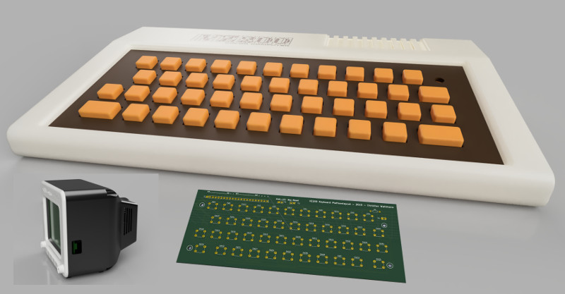
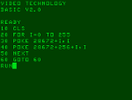
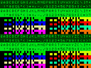
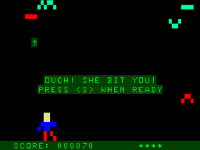

# vz200-remake
Ein Nachbau des VZ200 Color Computers (Vtech / Dick Smith 1983)

**[==>> RESOURCEN & DOWNLOADS <<==](#resourcen-und-downloads)** 

**[=> Design und Druck der Bauteile](01_druck.md)**

**[=> Platinendesign und -produktion](02_platinendesign.md)**

**[=> Zusammenbau des VZ200](03_zusammenbau_vz200.md)**

**[=> Zusammenbau des Monitors mit TFT-Display, Raspberry-Pi und Lautsprecher](04_zusammenbau_monitor.md)**

**[=> Installation des Raspberry Pi](05_installation.md)**

**[=> Der VZ200 Emulator](06_emulator.md)**

**[=> VZ200 Companion App](apps/README.md)**

**[=> Nützliche Links](08_links.md)**

## Resourcen und Downloads

Hardware
* [STL files auf Thingiverse](https://www.thingiverse.com/thing:4415555)
* [3d-Modell VZ200](resources/3d-model/vz200.f3d)
* [3d-Modell Monitor](resources/3d-model/Monitor_5-Zoll.f3d) 
* [Gerber-Dateien für die Tastaturplatine](resources/gerber/vz200-keyboard-layout.zip)
* [Grafiken für die Tastatur](resources/aufkleber/Aufkleber-2x70perc.png)
* [Grafiken für das Logo](resources/aufkleber/logo_7x70perc_A4.png)

Software
* [JemuVZ200 Emulator V2.1](resources/releases/JemuVZ200-2.1.zip)
* VZ200 Companion App (TODO)

Dokumentation und Beispiele
* [Z80 Befehlssatz](resources/doc/z80.pdf)
* [VZ200 Basic Befehlssatz](resources/doc/VZ200-Basic.pdf)
* ["Hello World" (Assembler) Tutorial](resources/doc/tutorial/hello-world-asm-tutorial.pdf)
* ["Side Scrolling" (Assembler) Tutorial](resources/doc/tutorial/side-scroll-asm-tutorial.pdf)
* [Tutorial Präsentation (LibreOffice)](resources/doc/tutorial/VZ200-tutorial.odp)

Alle Sourcen sind zu finden unter
* [github.com/cwahlmann/vz200](https://github.com/cwahlmann/vz200)

