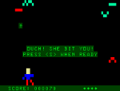

# vz200-remake
Ein Nachbau des VZ200 Color Computers (Vtech / Dick Smith 1983)

**[@ Design und Druck der Bauteile](01_druck.md)**

**[@ Platinendesign und -produktion](#platinendesign)**

**[@ Zusammenbau des VZ200](#zusammenbau)**

**[@ Zusammenbau des Monitors mit TFT-Display, Raspberry-Pi und Lautsprecher](#monitor)**

**[@ Installation des Raspberry Pi](#installation)**

**[@ Der VZ200 Emulator](#emulator)**

**[@ VZ200 Companion App](apps/README.md)**

**[@ Nützliche Links](#useful-links)**

## *VZ200-remake* auf der Makerfaire-Ruhr

    Wir haben uns sehr gefreut, im Programm der Makerfaire-Ruhr in Dortmund dabei zu sein.
    
    Allerdings wurde die Messe aufgrund der aktuellen Corona-Krise abgesagt, was wir einerseits sehr bedauern, 
    andererseits aber auch nachvollziehen können, denn die Gesundheit geht vor.

    Stattdessen werden wir jetzt nach und nach alles, was wir dort präsentieren wollten, 
    online stellen. Möge der eine oder die andere glückliche Stunden damit verbringen,
    den VZ200 nachzudrucken, zusammenzulöten und aufzubauen!
    
    Sollte die Makerfaire später im Jahr nachgeholt werden, was wir hoffen, so stehen die
    Chancen gut, dass wir uns dort sehen ;-) 

