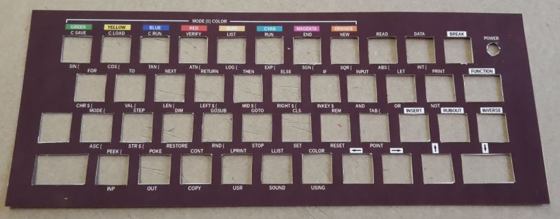
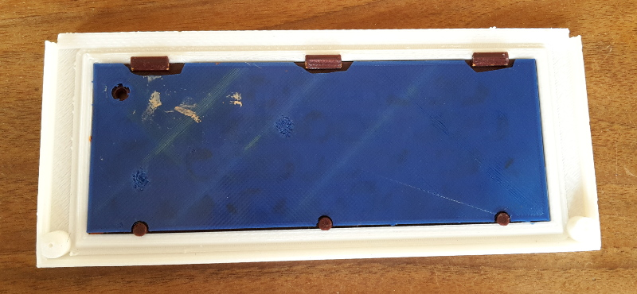
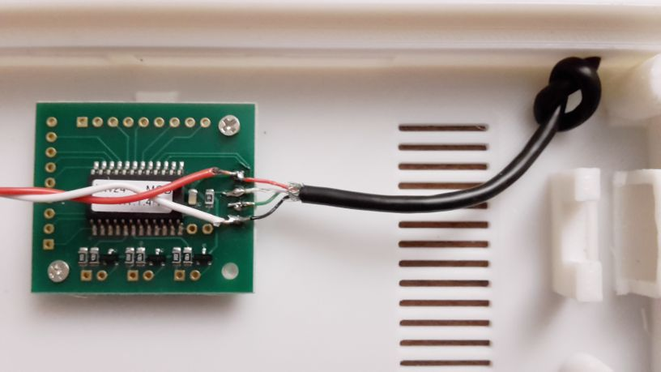
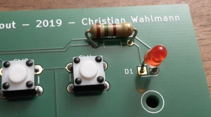
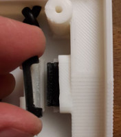
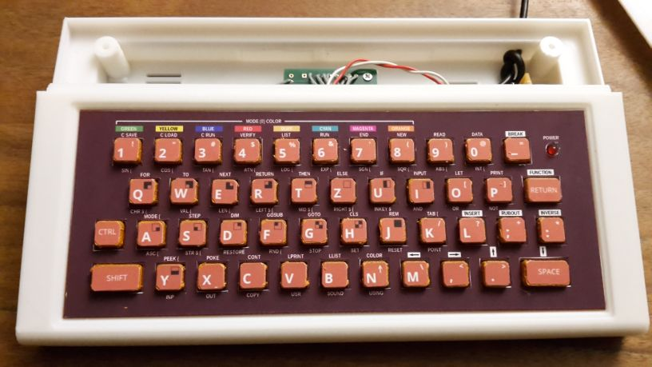
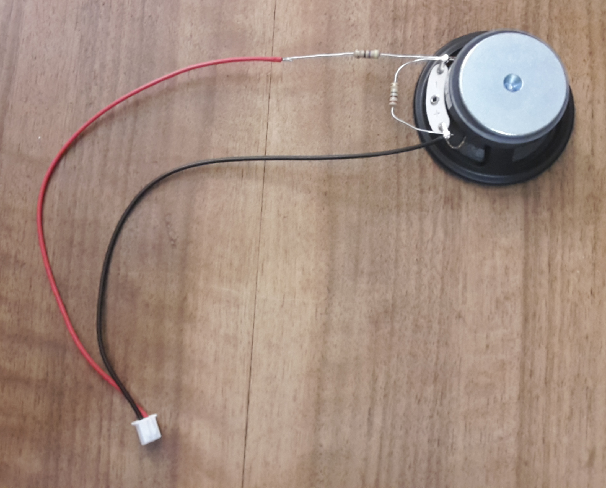
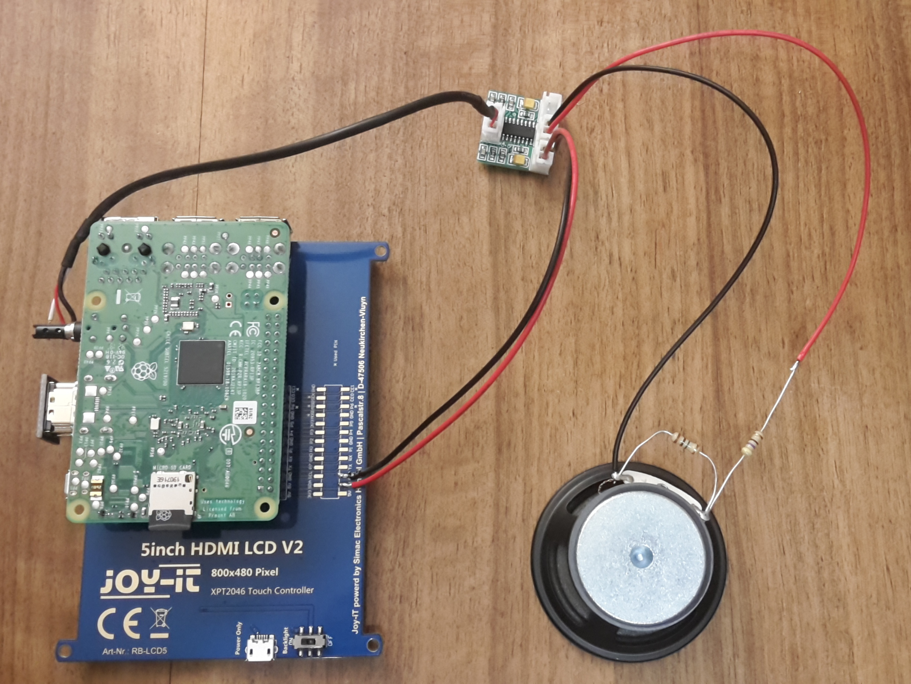

# VZ200
Ein Nachbau des VZ200 Color Computers (Vtech / Dick Smith 1983)


[](https://www.youtube.com/watch?v=7TxQ1y71ufA)

* [Design und Druck der Bauteile](#druck)
* [Platinendesign und -produktion](#platinendesign)
* [Zusammenbau des VZ200](#zusammenbau)
* [Zusammenbau des Monitors mit TFT-Display, Raspberry-Pi und Lautsprecher](#monitor)
* [Installation des Raspberry Pi](#installation)
* [Der VZ200 Emulator](#emulator) 
* [VZ200 Companion App](apps/README.md)
* [Nützliche Links](#useful-links)

# <a name="druck">Design und Druck der Bauteile</a>
## 3d-Modell
Das Modell wurde mit Autodesk Fusion 360 erstellt. 

**Bitte beachten**: Das Modell des Computergehäuses und die darin verbaute Elektronik sind dafür 70% der Originalgröße ausgelegt. Die STL-Dateien geben das bereits wieder; in den Fusion-Dateien (.3mf) hat das Gehäuse noch die Originalgröße. Wer das Modell in Originalgröße nachbauen möchte, muss die Pfosten für den Tastaturcontroller anpassen und die Tastaturplatine entsprechend skalieren, bevor sie geätzt wird. Außerdem muss gegebenenfalls die Position der Resetschalter-Halterung angepasst werden.


## Drucke
Die aus Fusion 360 exportierten STL-Dateien werden mit Ultimaker Cura 4.x druckfertig gemacht -> Das Projekt enthält gcode-Dateien für Creality Ender 3.

Gedruckt wird mit PLA (Gehäuse, Tastaturschablone, Resetschalter) und TPU-Filament (Tastaturmatte). 

Für den VZ 200 nehmen wir Weiß (Gehäuse), schokoladenbraun (Tastaturabdeckung) und eine beliebige TPU-Farbe für die Tastaturmatte (gummiartig).

# <a name="platinendesign">Platinendesign und -produktion</a>

Eigenes Platinenlayout mit Dip-Schaltern (6mm; Höhe über Platine: 4,5mm; 4 Füße), die über eine Gummi-Tastaturmatte betätigt werden.
Tastaturcontroller: KEYWARRIOR24_8_MODUL_KW24_8_MOD

Das Layout kann, als Zip mit GBR-Dateien, über diverse Anbieter in kleiner Stückzahl (meist >= 3) produziert werden. 

Gute Erfahrungen haben wir mit [Aisler](https://aisler.net) gemacht. 


# <a name="zusammenbau">Zusammenbau des VZ200</a>

Das Chassis beherbergt eine funktionierende Tastatur mit Power-LED und Reset-Taster.

Bei einer Größe von 70 Prozent gegenüber dem Original-Rechner passt der Raspberry Pi nicht mit ins Gehäuse. Dieser wird deshalb in
den Monitor integriert. Der VZ200 wird als USB-Tastatur an den Raspberry angeschlossen. 

(Ein Raspberry-Zero würde in das Gehäuse passen, es muss jedoch getestet werden, ob dieser für den Emulator genügend Rechenpower liefert.)

## benötigte Bauteile

| Bauteil | Beschreibung |
| ------- | ------------ |
| Gedruckte Teile | Boden, Abdeckung hinten, Tastatur (Rahmen, Schablone, Tastenmatte), Resetschalter + Klammer |
| Gedrucktes Logo | klare, selbstklebende, transparente A4 Polyesterfolie für Tintenstrahldrucker (z.B. von Photo Paper Direct PPD-39-20) |
| Gedruckte Tasten auf Vinylfolie | weiße, matte, selbstklebende A4 Vinylfolie für Tintenstrahldrucker (z.B. von Photo Paper Direct PPD-38-10) |
| Gedruckte Tastaturschablone auf Vinylfolie | weiße, matte, selbstklebende A4 Vinylfolie für Tintenstrahldrucker (z.B. von Photo Paper Direct PPD-38-10) |
| Modellfarbe für Tasten | EMAIL COLOR von Revell, Matt 35 (Hautfarben) und Matt 85 (Braun) |
| Tastaturplatine | mit Hilfe des Platinendesigns kann die Platine über diverse Anbieter gefertigt werden |
| Tastaturcontroller | ein USB-Keyboard-Controller mit vordefinierter Belegung: KEYWARRIOR24_8_MODUL_KW24_8_MOD |
| USB-Kabel | USB-Kabel mit Stecker und Litzen zum Einlöten |
| 45 Drucktaster | Bestückung der Tastaturplatine, 6x6 mm |
| 1 rote LED | die Power-LED, 3mm |
| 1 Widerstand | 150 Ohm (braun / grün / braun) |
| ein Stück Lochplatine | für den Drucktaster des Resetschalters, Lochabstand 2.54 mm |
| 1 Drucktaster | für den Resetschalter, 6x6 mm |
| 2 x Rot-Weiße Litze ca. 10 cm | für den Resetschalter und die Power-LED |
| 2 x 8-adriges Flachbandkabel ca. 10 cm | z.B. aus alten IDE-Flachbandkabeln, für die Verbindung Tastaturcontroler -> Tastaturplatine |
| ein Stück Isolierband | Abschirmung von Reset-Schalter und Tastaturplatine | 
| 7 kurze Schrauben M2 5mm | Befestigung von Tastaturplatine und -Controller |
| 2 kurze Schrauben M2 8mm | Befestigung der Reset-Schalter-Platine |
| 2 kurze M2 5mm und 2 lange M2 20mm Schrauben | Zusammenbau des Gehäuses |

## hintere Gehäuseabdeckung mit Logo versehen


Das gedruckt Logo muss wie abgebildet auf der hinteren Gehäuseabdeckung angebracht werden.


## Tastatur zusammenbauen
Benötigt werden die gedruckte Tastaturmatte, Modellfarbe und die gedruckten Tastenaufkleber.

Die Tasten der Matte müssen zunächst mit der Farbe (Matt 35, Hautfarben) mit einem Pinsel grundiert und dann
mit (Matt 85, Braun) gestrichen werden. Es sollten nur die Tasten selbst bemalt werden, damit die Matte gut zwischen Platine und Tastaturschablone passt und die Tasten leichtgängig bleiben. Ein Färben mit Sprühlack ist nicht zu empfehlen.


Die Aufkleber werden nun geschnitten.


Wichtig ist: damit die Tasten einen runden Eindruck machen, sollten die Ecken der Aufkleber diagonal angeschnitten werden.


Die geschnittenen Aufkleber werden auf die Tastaturmatte geklebt.


Nun wird die Tastaturschablone vorbereitet. Dazu wird die gedruckte Schablone und der gedruckte Aufkleber benötigt.


Die Aussparungen für die Tasten und die Power-LED werden mit dem Cutter herausgetrennt.




Dann wird der Aufkleber auf die Schablone geklebt. Wichtig ist, dass die Aussparungen mittig auf die der Schablone geklebt werden. Dabei bleibt ein kleiner Rand, damit sich die Tasten nicht am Aufkleber verhaken.


Nun wird die Tastenmatte von hinten in die Schablone gesteckt, und die Schablone in den Tastaturrahmen eingehakt.




## Verlöten und Einbau der Elektronik

Im Bild eine Übersicht der benötigten Einzelteile:


Der Resettaster wird auf die zugeschnittene Lochplatine gesteckt.


 Mit der Rot-weißen Litze wird der Taster mit der Tastaturplatine verbunden.


Dann werden noch zwei der kurzen Schrauben in die Platine geschraubt, zur späteren Befestigung am Boden des Gehäuses.


Das USB-Kabel wird wie abgebildet mit dem Tastaturcontroller verbunden.
**Achtung:** Das Kabel muss vor dem Löten durch das Loch des Gehäuseunterteils geführt und einfach verknotet werden!

| USB-Kabel Litzenfarbe | Controller Anschluss | 
| --------------------- | -------------------- |
| Rot | +5V |
| Weiß | D- |
| Grün | D+ |
| Schwarz | GND |

An +5V und GND wird zusätzlich die zweite Rot-Weiße Litze für die Power-LED angelötet:

| Power-LED Litzenfarbe | Controller Anschluss | 
| --------------------- | -------------------- |
| Rot | +5V |
| Weiß | GND |



Nun werden die grauen Flachbandkabel an den Controller gelötet, an die Anschlüsse X0-X7 und Y0-Y7:


Jetzt wird die Tastaturplatine mit Tastern, der Power-LED und dem Vorwiderstand für die LED bestückt:


Der Plus-Pol der LED (langes Bein) muss in den quadratischen Lötkontakt der Platine gelötet.



Die Ausrichtung der Taster ergibt sich aus den Abständen der Lötkontakte auf der Platine.


Nun wird die Rot-weiße Litze, welche an +5V / GND des Tastaturcontrollers angelötet ist, an die Tastaturplatine angelötet. Der weißumrandete Lötkontakt ist Minus (weiße Litze), der quadratische Kontakt ist Plus (rote Litze).
Danach werden die beiden Flachbandkabel an die Tastaturplatine gelötet. Hier ist sehr auf die Ausrichtung zu achten, die Lötkontakte der Tastaturplatine sind mit x0-x7 und y0-y7 beschriftet.


Nun wird der Reset-Taster ins Gehäuse eingebaut. Zunächst wird der gedruckte Reset-Schalter in das Gehäuse geschoben und mit der Klammer gesichert.




Dann wird die Platine mit dem Drucktaster aufgesetzt.


Nun wird der Tastaturcontroller mit drei kurzen Schrauben in das Gehäuse geschraubt.


Auf den Reset-Taster wird etwas Isolierband geklebt, damit die Schraube unter der Tastaturplatine keinen Kurzschluss verursachen kann.


Die Platine wird mit vier kurzen Schrauben im Gehäuse befestigt.


Zuletzt werden der Tastaturrahmen und das hintere Gehäuseteil aufgesetzt und auf der Rückseite mit zwei langen und zwei kurzen Schrauben befestigt.




Damit ist der VZ200 fertig. Der Emulator "JEmu" kann übrigens sowohl auf einem Raspberry PI als auch auf einem PC betrieben werden. Der VZ200 fungiert dabei als USB-Tastatur.

Hinweis: Falls die Tastatur prellt (mehrere Zeichen pro Tastendruck erzeugt) oder verschiedene Buchstaben auf einmal erscheinen, dann gibt es vermutlich einen Kurzschluss zwischen zwei Microschaltern. Das kann schnell passieren, falls nicht alle der sehr feinen Litzen der Kabel sauber verlötet werden und ggf. zur Seite wegstehen. 

Um das zu beheben, empfehlen wir, die Platine von beiden Seiten um die betreffenden Tasten herum unter einer starken Lampe genau zu betrachten, eventuell unter der Zuhilfenahme einer Lupe. Selbst feinste Drähtchen reflektieren das Licht aus einem bestimmten Blickwinkel. Diese dann mit einem Cutter abheben und abschneiden, um den Kurzschluss zu beheben. 

Weitere Fehlerquelle: Kalte Lötstellen (das gilt für den kompletten Zusammenbau). Diese erkennt man daran, dass der Lötzinn nicht glänzt, sondern leicht matt und milchig erscheint. Diese Stellen bitte noch einmal nachlöten. 

# <a name="monitor">Zusammenbau des Monitors mit TFT-Display, Raspberry-Pi und Lautsprecher</a>

## benötigte Bauteile

| Bauteil | Beschreibung |
| ------- | ------------ |
| Gedruckte Teile | Vorderseite, Front, Rückseite, Befestigungsring für Lautsprecher, 4 Gummifüße |
| Audio-Verstärker | Mini Audio Verstärkerplatine PAM8403 DC 5V (z.B. über https://www.roboter-bausatz.de) |
| 3,5er Stereo Klinkenstecker | gerne gebraucht, da dieser sowieso "entkernt" werden muss |
| Lautsprecher | 2 Zoll / 5 cm Miniaturlautsprecher 3 W 4 Ohm |
| Widerstände für Spannungsteiler: 1x 1000 kOhm, 1x 47 Ohm| der Spannungsteiler reduziert Spannung direkt am Lautsprecher und damit auch die Verstärker-eigenen Störgeräusche |
| Raspberry Pi | Modell >= 3b |
| TFT-Display | JOY-iT 5“ HDMI Touchscreen Display |
| 4 Schrauben M2 6mm | Befestigung des Lautsprechers im Gehäuse |
| 4 Schrauben M2 8mm | Verschrauben des Gehäuses |
| 4 Schrauben M2 6mm| Befestigung des Displays |


## Zusammenbau des Monitors

Das TFT wird auf die GPIO-Pins des Raspberry aufgesteckt und anschließend mit der HDMI-Brücke verbunden.


Der Audioverstärker "PAM8403" verstärkt die Signale des Raspberry sehr laut, produziert dabei aber auch eine Menge Nebengeräusche. Durch einen Spannungsteiler wird die Lautstärke etwas abgedämpft, was sich positiv auf die Störgeräusche auswirkt. 




Das Audiokabel wird wie abgebildet an den Klinkenstecker gelötet.


Die Stromversorgung des Audioverstärkers wird über die GPIO-Pins am TFT-Display abgegriffen (das TFT nutzt nur wenige der Pins selbst).


Die Gesamtverkabelung sieht dann so aus. Bitte auf die Bezeichnungen an der Verstärkerplatine achten, die Stecker dürfen nicht verkehrt eingesteckt werden.



Wenn alles richtig ist, kann der rohe VZ200 schon in Betrieb genommen werden.


Um Kurzschlüssel vorzubeugen, wird um den langen Widerstand des Spannungsteilers ein Stück Isolierband geklebt.


Der Lautsprecher wird mit Hilfe des gedruckten Rings mit vier Schrauben ins Gehäuse geschraubt. Die Verstärkerplatine wird mit doppelseitigem Klebeband, einem Stück Kautschuk o.ä. angeklebt.


Das TFT_Display wird mit dem angesteckten Raspberry mit vier Schrauben in der Vorderseite des Gehäuses befestigt.


Dann werden alle Kabel an die Verstärkerplatine gesteckt und die beiden Monitorhälften werden mit 4 Schrauben aneinander geschraubt.


Unten an den Monitor werden die vier Gummifüße geklebt.


Die separat gedruckte Front wird nun von vorne an das Gehäuse geklebt.


Wer mag, kann das Gehäuse noch nach Belieben mit Farbe versehen. Hier ein Beispiel im RETRO-Look.


# <a name="installation">Installation des Raspberry Pi</a>

## Projekt bauen mit Gradle:
```
gradle createVZ200Zip
```
Es entsteht ein Zip mit allen benötigten Dateien unter `build\distributions\JemuVZ200.zip`

## Installieren der Desktop-Version des Betriebssystems Raspbian
siehe Raspbian-Dokumentation unter www.raspbian.org
(Raspbian Buster Desktop Lite)

## gebautes Zip installieren
Zip-Datei ins Home-Verzeichnis des Raspberry kopieren und entpacken.
Danach sollte folgende Verzeichnisstruktur entstanden sein:

```
pi@raspberrypi:~ $ unzip JemuVZ200.zip
Archive:  JemuVZ200.zip
   creating: vz200/
   creating: vz200/system/
   creating: vz200/system/vz/
   creating: vz200/system/vz/rom/
  inflating: vz200/system/vz/rom/VZ.CHR
  inflating: vz200/system/vz/rom/VZBAS12.ROM
  inflating: vz200/system/vz/rom/README.txt
   creating: vz200/tape/
  inflating: vz200/tape/README.txt
   creating: vz200/tape/default/
  inflating: vz200/tape/default/README.txt
   creating: vz200/vz/
  inflating: vz200/vz/README.txt
  inflating: vz200/vz200-all.jar
  inflating: desktop-wallpaper.png
  inflating: vz200.desktop
  inflating: vz200.sh
```

## Startskript ausführbar machen
`dos2unix` installieren:
```
sudo apt-get install dos2unix
```

Zeilenumbrüche nach Unix konvertieren:
```
dos2unix vz200.desktop
dos2unix vz200.sh
```

Execute-Flag setzen:
```
chmod +x vz200.sh
```

## Emulator automatisch starten
Die Datei `vz200.desktop` in den Autostart-Ordner kopieren:
```
mkdir ~/.config/autostart
cp vz200.desktop ~/.config/autostart
```
## joe Texteditor installieren
```
sudo apt-get install joe
```
(Alternativ kann auch der schon installierte Editor `nano` genutzt werden.)

## JAVA und ALSA-Sound-Treiber installieren
Installieren der OpenJDK-8 Runtime und des ALSA-Treibers mit `apt-get`:
```
sudo apt-get install openjdk-8-jre
sudo apt-get install alsa-base alsa-utils
```
Die Java-Sound-Konfiguration anpassen (PulseAudio auskommentieren, DirectAudioDevice einkommentieren):
```
sudo joe /etc/java-8-openjdk/sound.properties
#javax.sound.sampled.Clip=org.classpath.icedtea.pulseaudio.PulseAudioMixerProvider`
#javax.sound.sampled.Port=org.classpath.icedtea.pulseaudio.PulseAudioMixerProvider
#javax.sound.sampled.SourceDataLine=org.classpath.icedtea.pulseaudio.PulseAudioMixerProvider
#javax.sound.sampled.TargetDataLine=org.classpath.icedtea.pulseaudio.PulseAudioMixerProvider

javax.sound.sampled.Clip=com.sun.media.sound.DirectAudioDeviceProvider
javax.sound.sampled.Port=com.sun.media.sound.PortMixerProvider
javax.sound.sampled.SourceDataLine=com.sun.media.sound.DirectAudioDeviceProvider
javax.sound.sampled.TargetDataLine=com.sun.media.sound.DirectAudioDeviceProvider
```
Editor verlassen mit STRG-K und X.
   
Raspi-Configuration starten und folgende Einstellungen vornehmen:
- Umstellen audio auf headphone
```
sudo raspi-config
```

## Splash-Screen installieren:

Bearbeiten der Datei `/boot/config.txt`:
```
sudo joe /boot/config.txt
```
Folgende Zeile hinzufügen:
```
disable_splash=1
```

Bearbeiten der Datei `/usr/share/plymouth/themes/pix/pix.script`:
```
sudo joe /usr/share/plymouth/themes/pix/pix.script
```
Folgende Zeilen auskommentieren:
```
message_sprite = Sprite();
message_sprite.SetPosition(screen_width * 0.1, screen_height * 0.9, 10000);
my_image = Image.Text(text, 1, 1, 1);
message_sprite.SetImage(my_image);
```

Bearbeiten der Datei `/boot/cmdline.txt`:
```
sudo joe /boot/cmdline.txt
```
- `console=tty1` durch `console=tty3` ersetzen
- und folgende Parameter ans Ende der Zeile anfügen:
```
splash quiet plymouth.ignore-serial-consoles logo.nologo vt.global_cursor_default=0
```

Splash-Screen anpassen:
```
sudo cp ~/vz200/desktop-wallpaper-1.png /usr/share/plymouth/themes/pix/splash.png
```
Quelle: https://scribles.net/customizing-boot-up-screen-on-raspberry-pi/

In der Desktop-Umgebung das Hintergrundbild `~/vz200/desktop-wallpaper-1.png` einstellen.

## Lautstärke auf Maximum stellen:
```
amixer sset 'Master' 65536
```
Taskleiste ausblenden: Rechtsklick auf Taskleite - Leisteneinstellungen - Erweitert: Leiste bei Nichtbenutzung minimieren + Größe bei minimiertem Zustand: 0 Pixel

HDMI-Settings in /boot/config.txt anpassen: `disable-overscan=1`, `hdmi_group=1`, `hdmi_mode=3`

Nach einem Reboot sollte der Emulator im Vollbildmodus starten.

# <a name="emulator">Der VZ200 Emulator</a>

Der genutzte Emulator ist eine angepasste Version des Java-Emulators 'jemu': http://jemu.winape.net/

## Port Konfiguration

application.properties (Default 8080):

```
server.port = 10101
```

Reset-Taste: [ESC]

## Erweiterung laden / speichern von .vz:

```basic
OUT 252,1
READY
```

PORT | IN / OUT | Beschreibung
-----|----------|-------------
252  | OUT      | LOAD .vz program no. [n]
253  | OUT      | SAVE .vz program no. [n]

Alle Programme n <= 100 sind readonly.

(werden in [home]/vz200/vz abgelegt)

## Erweiterung Tape-Controle

```basic
PRINT INP(254)
10
READY
```

PORT | IN / OUT | Beschreibung
-----|----------|-------------
254  | OUT      | 0: STOP, 1: PLAY, 16: RECORD
255  | OUT      | REWIND to position [n]
254, 255  | IN  | get LSB / MSB of tape position

(werden in [home]/vz200/tape abgelegt)

## Erweiterung Volume-Controle

PORT | IN / OUT | Beschreibung
-------|-------|-------------
251 | R/W | liest / setzt die Lautstärke (0-255)

## REST-Interface

```bash
curl -X POST http://localhost:8080/vz200/vz 
     -H "Content-Type:application/octet-stream" 
     --data-binary @/D/Downloads/8bit/vz200/jvz_021/vz_files/games_autostart/CRASH.vz
```
Basis-Pfad: [HOST]:[PORT]/vz200

Endpunkt | Method | Request | Response | Beschreibung
---------|--------|---------|----------|-------------
/        | GET    |         | String   | Info
/reset   | POST   |         | String   | Reset Computer
/vz      | POST   | application/octet-stream | String | .vz-Programm einspielen
/vz[?autorun={True/False}][&range={start-end}]      | GET    |         | application/octet-stream | .vz-Programm auslesen; autorun: mit Autostart-Flag speichern; range: Speicherbereich (default: Basic-Pointer)
/bas     | POST   | application/octet-stream | String | Basic-Programm-Source einspielen
/bas     | GET   |          | application/octet-stream | Basic-Programm-Source auslesen. 
/asm[?autorun={True/False}]     | POST   | application/octet-stream | Range: {von-bis} | Assembler-Programm-Source einspielen und ggf. starten (default True)
/asmzip[?autorun={True/False}]     | POST   | application/octet-stream | Range: {von-bis} | Zip-Datei mit Assembler-Programm-Source einspielen und ggf. starten (default True)
/asm/{von[-bis]} | GET    | | String | Speicherbereich als Maschinenprogramm auslesen
/hex     | POST   | application/octet-stream | String | Hexadezimalen Source einspielen und starten
/hex/{von[-bis]} | GET    | | String | Speicherbereich in hexadezimalem Format auslesen
/printer/flush | GET | | String | zuletzt gedruckte Zeilen auslesen
/tape    | GET    |         | String | Namen des eingelegten Tapes lesen
/tape/{name} | POST    |        | String | Type mit angegebenem Namen einlegen
/tape/slot | GET    |         | Integer | aktuellen Slot des Tapes lesen
/tape/slot/{id} | GET    | Integer | | Tape zu angegebenem Slot spulen
/tape/play | POST | | Integer | Tape starten; gibt Slot zurück
/tape/record | POST | | Integer | Aufnahme starten; gibt Slot zurück
/tape/stop | POST | | Integer | Tape stoppen; gibt Slot zurück
/typetext | POST | text/plain | String | Tippt Text in den Bildschirm des VZ (in Arbeit)
/sound/{volume} | POST | Integer | String | Audio-Lautstärke schreiben von 0 bis 255
/sound     | GET  | | Integer | Audio-Lautstärke lesen
/registers | GET  | | String | gibt den den Wert aller Z80-Register als JSON zurück

# <a name="useful-links">Nützliche Links</a>

VZ-Dokumentation
* http://vzalive.bluebilby.com/archive/
* http://www.vz200.org/bushy/
* http://www.vz200.org/downloads.php

VZ-Software
* http://vzalive.bluebilby.com/downloads/downloads.html
* http://www.vz200.org/downloads.php

VZ-Emulatoren
* http://vzalive.bluebilby.com/emulators/
* http://jemu.winape.net
* http://vzalive.bluebilby.com/emulators/winvz4.zip
* http://vzalive.bluebilby.com/emulators/vzem_22.zip
* http://www.mess.org/download.html
* http://www.vz200.org/weblinks.php?cat_id=5

VZ-ROMS
* http://vzalive.bluebilby.com/emulators/vz200.zip
