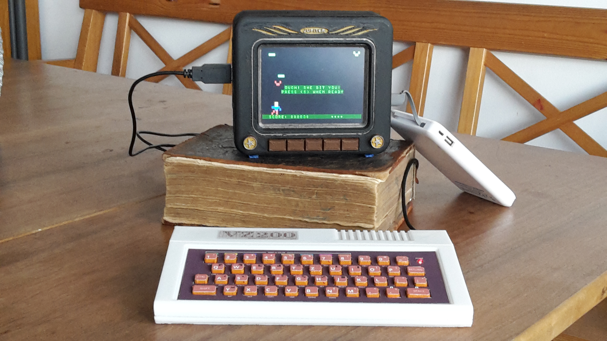

# vz200-remake
Ein Nachbau des VZ200 Color Computers (Vtech / Dick Smith 1983)

# *VZ200-remake* auf der Makerfaire-Ruhr

Wir freuen uns, im Programm der Makerfair-Ruhr in Dortmund dabei zu sein!

* vom **28. bis 29. März 2020** in der DASA in Dortmund

Während der ganzen Messe schrauben und löten wir Modelle zusammen. Ihr könnt uns dabei über  die Schulter schauen, und auch gerne selbst Hand anlegen. Was wir gemeinsam produziert haben, werden wir im Laufe der Messe verlosen.

Ob Space-Invader oder Hallo Welt – fertige Modelle des „VZ200 Color Computer“ stehen zum Ausprobieren bereit.

Zu diesen Zeiten steigen wir tiefer in einzelne Themen ein:

* 11:00h – 3D-Design und -Druck
* 14:00h – Platinenlayout mit KiCad
* 16:00h – Basic- und Assembler-Programmierung

# Das erwartet dich:

* Design- und Druckdaten für ...

... einen VZ200 Color Computer in 70% Originalgröße

... einen Monitor mit TFT-Display, Raspberry PI und Lautsprecher

* Platinendesign und .gbr-Dateien für eine funktionierende Tastatur
* VZ200-Emulator (basierend auf 'jemu': http://jemu.winape.net) mit Datasette-Emulation und REST-Schnittstelle
* VZ200 Companion App zur Fernsteuerung des VZ200 über die REST-Schnittstelle
* Liste aller benötigten Bauteile
* detaillierte Bau- und Installationsanleitung

# Impressionen von der Baustelle
 
Der VZ200 sollte eine voll funktionsfähige Gummitastatur bekommen. Gelöst haben wir das mit einer selbst designten Platine mit Drucktastern, auf der die gedruckte Matte mit Gummitasten liegt, verbunden mit einem USB-Tastaturcontroller. In Einzelteilen: 

Der Emulator läuft auf einem Raspberri PI 3b und einem aufgesetzten 5 Zoll HDMI-Display. Für den Sound sorgt ein kleiner Verstärkerchip. Alles zusammen wird in ein Monitorgehäuse eingebaut.

Hier ein Bild des ersten fertigen Modells. Den Source zum Spiel gibt es unter [the-hunter.asm](examples/the-hunter.asm), oder als .VZ-File [thehunter.vz](examples/thehunter.vz)

