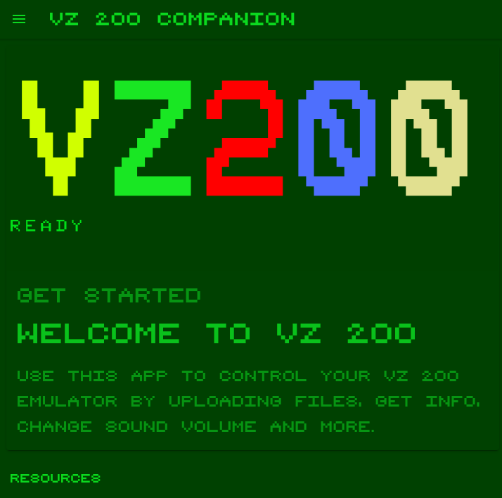

# VZ200 Companion App

This App supports the retro enthusiast while dealing with the VZ200 - Emulator. It allows for doing file transfers and operations on the emulated device as well as organizing files made available to the emulation. 

## Installation / prerequisites

### Install NPM

Download and install NodeJS from the official site.

https://nodejs.org/en/download/

### Install Ionic

> npm install -g ionic

### Install git

https://git-scm.com/downloads

## Build and run the App

Checkout the App from this repo into a directory of your choice:

> git clone https://github.com/cwahlmann/vz200/new/master/apps/VZ200-App

Install dependencies

> npm i

Run the App

> ionic serve

The App should be available at http://localhost:4200
