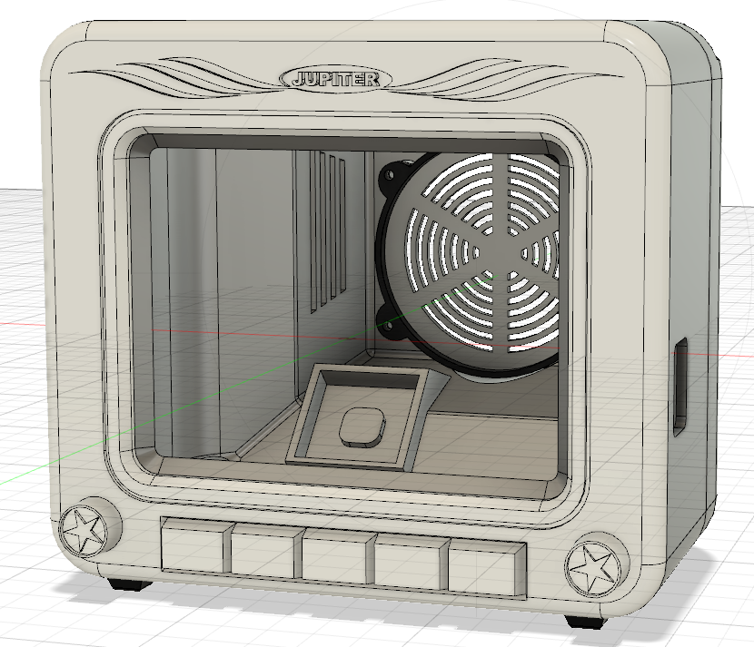

**[BACK](README.md)**
# <a name="print">Designing and printing the Parts</a>
## 3d Model
The model has been designed with Autodesk Fusion 360.

**Word of advice**: The model of the computer case and the electronics within are sized at 70% of the original size. The STL files do reflect this already, though in the Fusion files (.3mf) the case still has it's original size. If you want to build the replica in 100% you need to adjust the ports for the keyboard controller and circuit board before having it being acit-treat. Also most likely the positon of the reset button holder needs to be adapted.

## Printing

The STL files exported from Fusion 360 have to be prepared and sliced for printing, we used Cura 4.x. This project already contains GCODE files for Creality Ender 3. 

We recommend printing with PLA for the VZ200 Case, the keyboard mask and the reset button. For the keyboard mat a flexible material is required, like NinjaFlex or TPU.

With the VZ200 we use white for the case, chocolade brown for the keyboard mask and any color for the keyboard mat, it will be painted later anyways.

**[BACK](README.md)**
