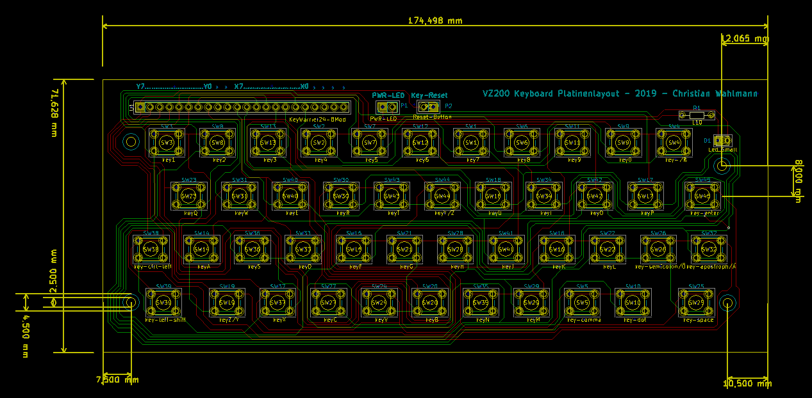
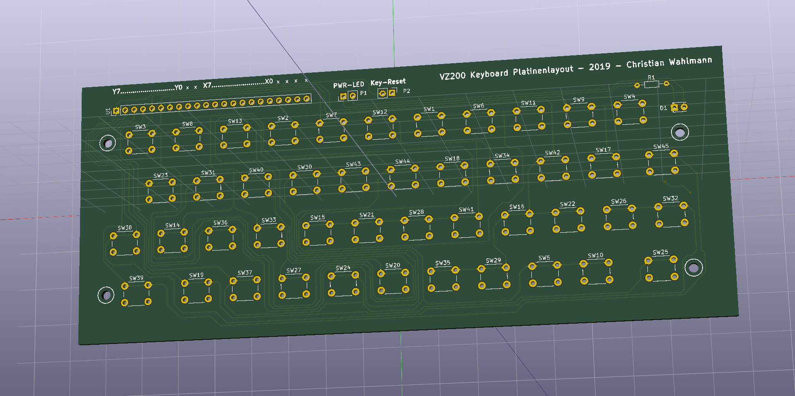

**[BACK](README.md)**
# <a name="circuitboarddesign">Cirquit board design and production</a>

Custom made cirquit board design with micro switches (6mm; height over board: 4,5mm, four stamps), which are operated through a TPU keyboard mat. Keyboard controller: KEYWARRIOR24_8_MODUL_KW24_8_MOD

This circuit board design can be produced by various workshops in small numbers, mostly require >= 3. Those workshops usually accept a zip file with GBR files.

Our boards were produced by [Aisler](https://aisler.net). 

**[BACK](README.md)**
