**[BACK](README.md)**
# <a name="assemblyvz200">Assembly of the VZ200</a>

The case contains a fully functional keyboard with power LED and a reset button.

At a size of 70 % of the original VZ200 the Raspberry Pi will not fit into the case, thus it will be integrated into the monitor. The VZ200 will be connected to the Raspberry by a USB 2.0 cable.

## Required Parts

| Part | Description |
| ------- | ------------ |
| 3D printed parts | Bottom, Cover back, Keyboard (Frame, mask, keyboard mat), Reset Switch + Clamp |
| Printed Logo | clear, self adhesive and transparent A4 Polyester foil for ink jets |
| Printed Keys on vinyl sheet | white matt self adhesive A4 vinyl foil for ink jets |
| Printed Keyboard mask on vinyl sheet  | white matt self adhesive A4 vinyl foil for ink jets |
| Scale modeling color | EMAIL COLOR by Revell, matt 35 (skin tone) and matt 85 (brown) |
| Keyboard circuit board | available through various workshops by using the accompanied GBR files |
| Keyboard controller | an USB keyboard controller with predefined mapping: KEYWARRIOR24_8_MODUL_KW24_8_MOD |
| USB cabel | USB cable with plug and bare wires on one end |
| 45 micro switches | To be soldered on the keyboard cirquit board, 6x6 mm |
| 1 red LED | Power-LED, 3mm |
| 1 resistor | 150 Ohm (brown / green / bworn) |
| Small piece of perforated circuit board | Used for the reset button, hole distance 2.54 mm |
| 1 micro switch | for the reset button, 6x6 mm |
| 2 x red white wire ca. 10 cm | to connect the POWER LED and the reset button |
| 2 x 8 core flat cable ca. 10 cm | to connect keyboard controller to keyboard cirquit board |
| Isolation tape | to isolate reset button from keyboard cirquit board | 
| 7 small screws M2 5mm | to attach keyboard controller and cirquit board |
| 2 short screws M2 8mm | to attach reset button board |
| 2 short M2 5mm and 2 long M2 20mm screws | to assemble the VZ200 case |

## Attach the Logo to the back VZ200 casing
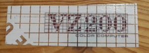

Apply the printed logo on the back case cover as shown in the picture.

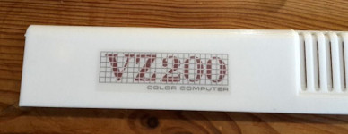

## Assemble the keyboard
For this step you require the printed keyboard mat, the scale modeling color and the printed keyboard stickers. Do not use Airbrush or any other spraying color as this will soak the TPU and increase it's size substantially.

The keys of the mat need to be painted first with Revel Matt 35, Skin Color as a base color, then overpainted with Matt 35, brown. There is no need to paint the whole mat as it is also covered by the keyboard mask, also this helps fitting the keys into the mask and keep them free to move.

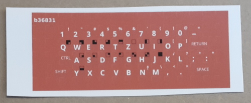
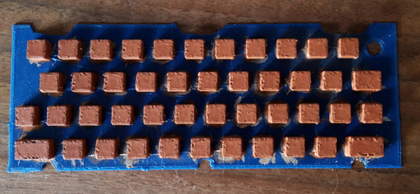

The stickers have to be cut now.

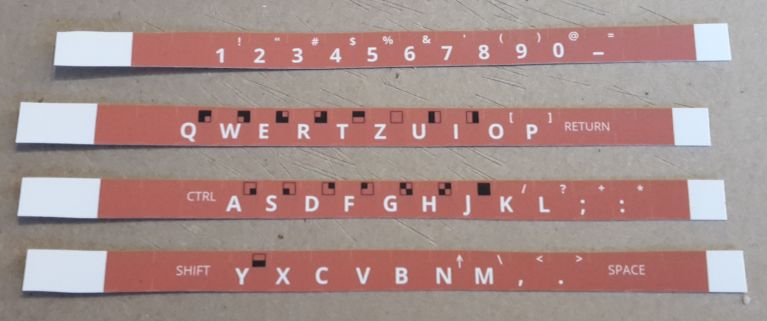
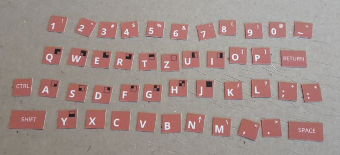

Important notice: To achieve a rounded look cut the corners diagonally.

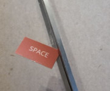
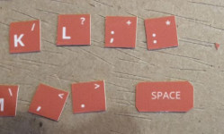
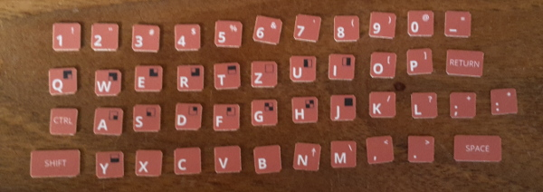

The cut stickers are now applied on to the keyboard mat.

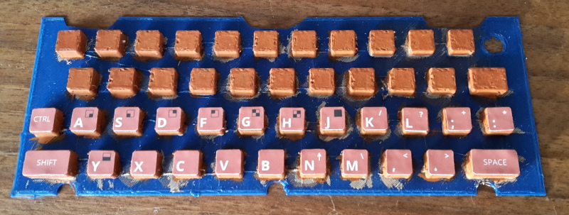
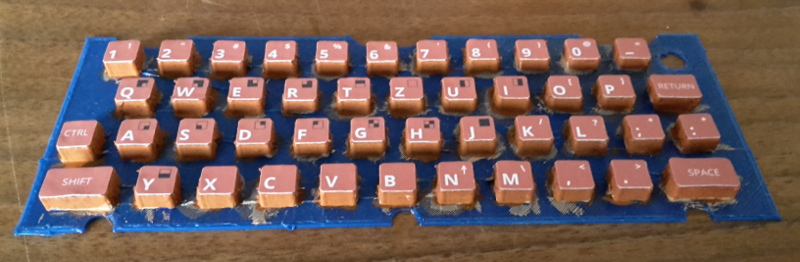

Now to prepare the keyboard mask. Have the 3d printed mask and the ink jet printed sticker ready.

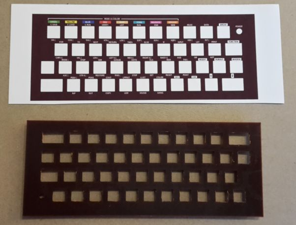

Use a cutter to remove the material for the keys and the Power LED.

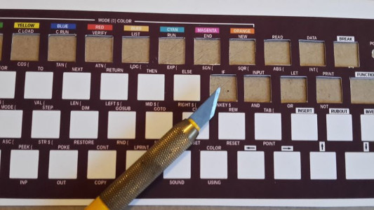
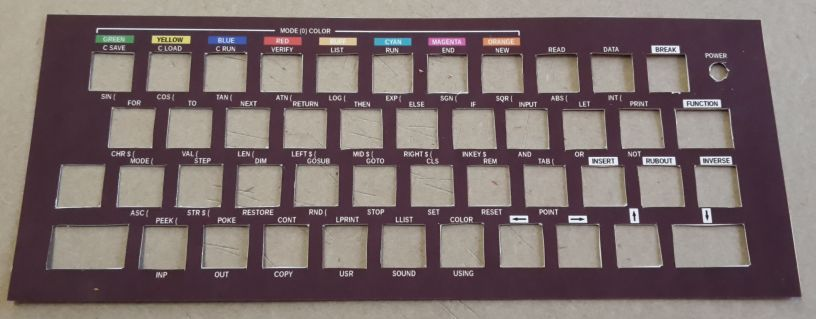

Now the sticker will be applied to the mask. Carefully adjust the sticker to make sure the holes are centered around their counterparts on the mask.

There will be a small margin left so that the keys won't stick to the sticker.

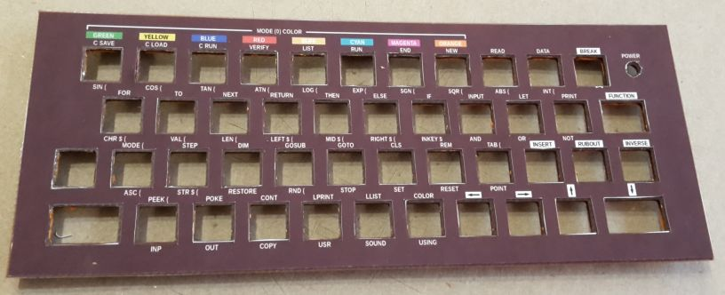

Now the keyboard mat will be inserted into the mask's back and the mask inserted into the keyboard frame.

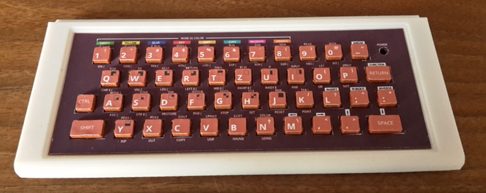
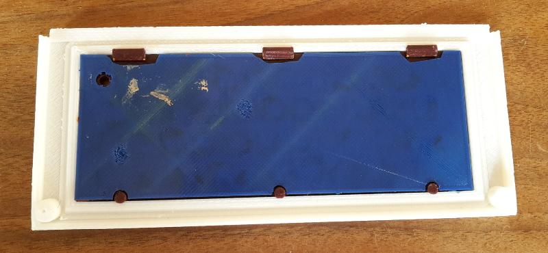

## Verlöten und Einbau der Elektronik

Im Bild eine Übersicht der benötigten Einzelteile:

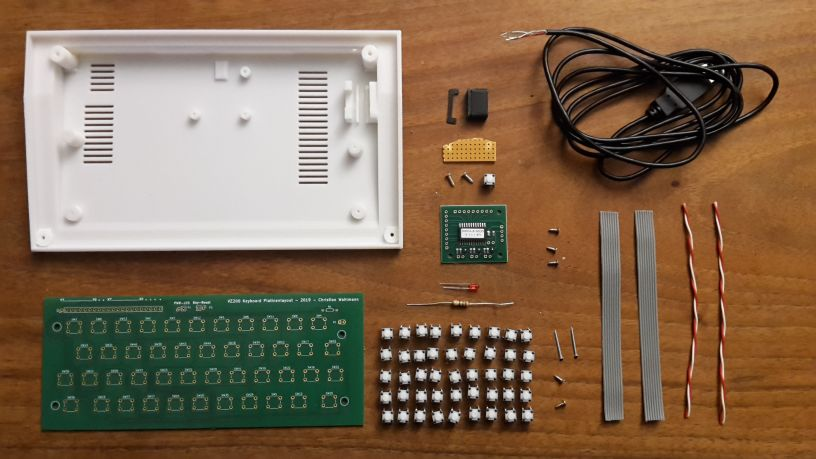

Der Resettaster wird auf die zugeschnittene Lochplatine gesteckt.

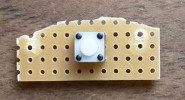
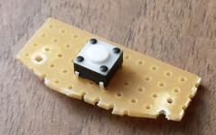

 Mit der Rot-weißen Litze wird der Taster mit der Tastaturplatine verbunden.

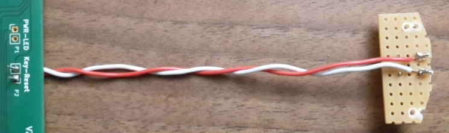

Dann werden noch zwei der kurzen Schrauben in die Platine geschraubt, zur späteren Befestigung am Boden des Gehäuses.

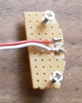

Das USB-Kabel wird wie abgebildet mit dem Tastaturcontroller verbunden.
**Achtung:** Das Kabel muss vor dem Löten durch das Loch des Gehäuseunterteils geführt und einfach verknotet werden!

| USB-Kabel Litzenfarbe | Controller Anschluss | 
| --------------------- | -------------------- |
| Rot | +5V |
| Weiß | D- |
| Grün | D+ |
| Schwarz | GND |

An +5V und GND wird zusätzlich die zweite Rot-Weiße Litze für die Power-LED angelötet:

| Power-LED Litzenfarbe | Controller Anschluss | 
| --------------------- | -------------------- |
| Rot | +5V |
| Weiß | GND |

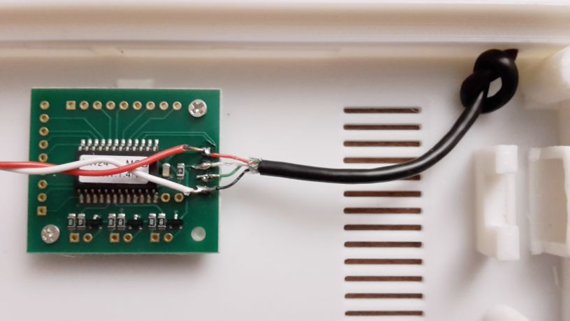

Nun werden die grauen Flachbandkabel an den Controller gelötet, an die Anschlüsse X0-X7 und Y0-Y7:

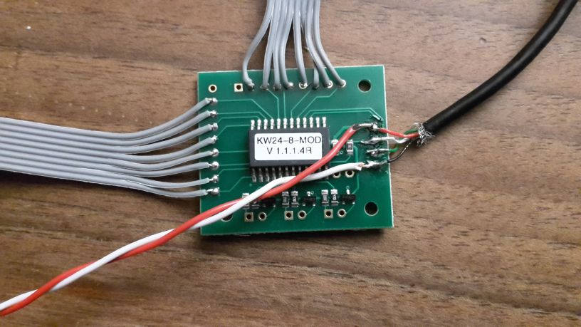
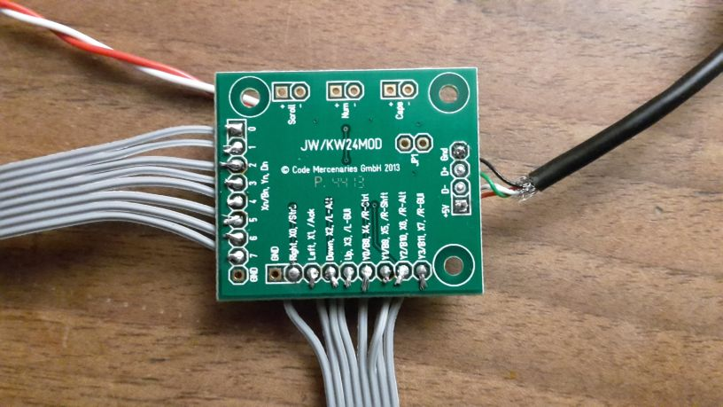

Jetzt wird die Tastaturplatine mit Tastern, der Power-LED und dem Vorwiderstand für die LED bestückt:

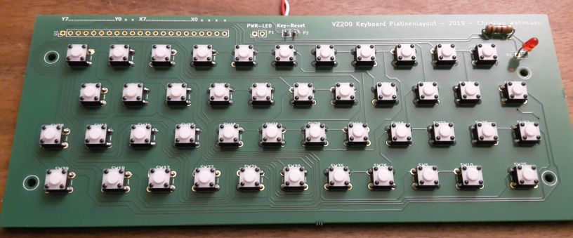

Der Plus-Pol der LED (langes Bein) muss in den quadratischen Lötkontakt der Platine gelötet.

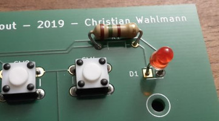

Die Ausrichtung der Taster ergibt sich aus den Abständen der Lötkontakte auf der Platine.

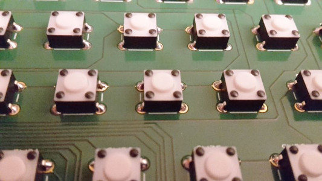

Nun wird die Rot-weiße Litze, welche an +5V / GND des Tastaturcontrollers angelötet ist, an die Tastaturplatine angelötet. Der weißumrandete Lötkontakt ist Minus (weiße Litze), der quadratische Kontakt ist Plus (rote Litze).
Danach werden die beiden Flachbandkabel an die Tastaturplatine gelötet. Hier ist sehr auf die Ausrichtung zu achten, die Lötkontakte der Tastaturplatine sind mit x0-x7 und y0-y7 beschriftet.

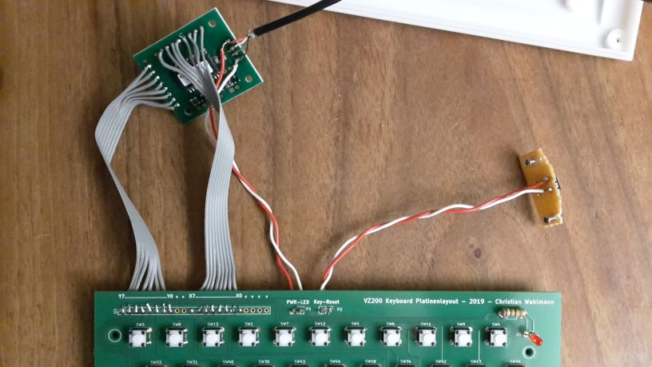
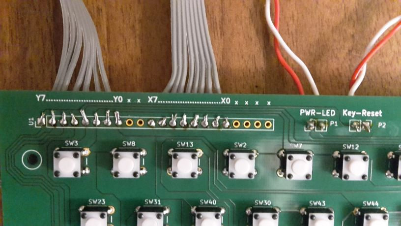

Nun wird der Reset-Taster ins Gehäuse eingebaut. Zunächst wird der gedruckte Reset-Schalter in das Gehäuse geschoben und mit der Klammer gesichert.

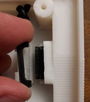
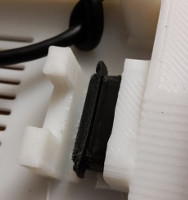

Dann wird die Platine mit dem Drucktaster aufgesetzt.

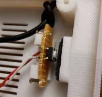

Nun wird der Tastaturcontroller mit drei kurzen Schrauben in das Gehäuse geschraubt.

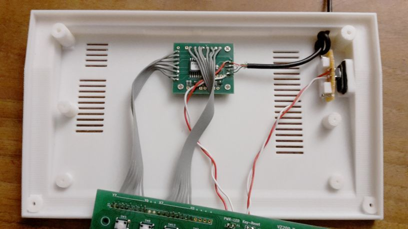

Auf den Reset-Taster wird etwas Isolierband geklebt, damit die Schraube unter der Tastaturplatine keinen Kurzschluss verursachen kann.

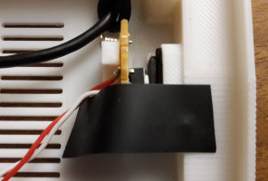

Die Platine wird mit vier kurzen Schrauben im Gehäuse befestigt.

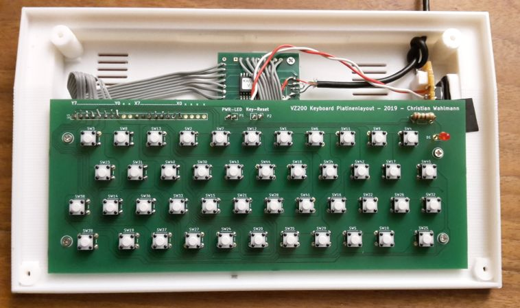

Zuletzt werden der Tastaturrahmen und das hintere Gehäuseteil aufgesetzt und auf der Rückseite mit zwei langen und zwei kurzen Schrauben befestigt.

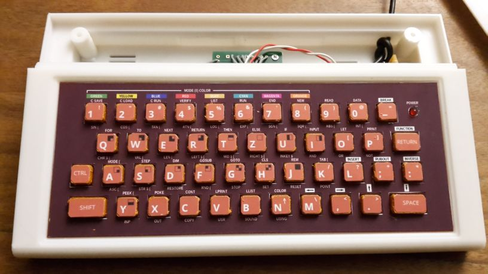
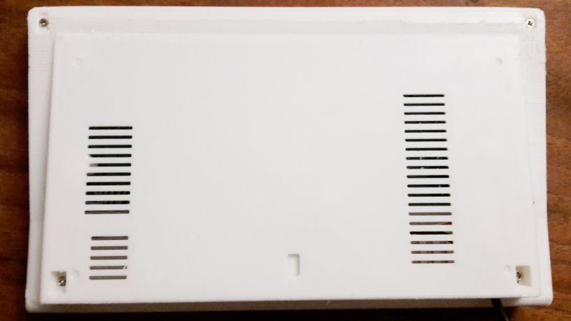
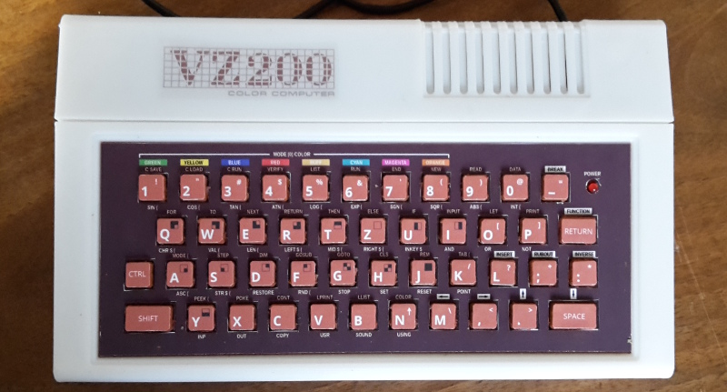

Damit ist der VZ200 fertig. Der Emulator "JEmu" kann übrigens sowohl auf einem Raspberry PI als auch auf einem PC betrieben werden. Der VZ200 fungiert dabei als USB-Tastatur.

Hinweis: Falls die Tastatur prellt (mehrere Zeichen pro Tastendruck erzeugt) oder verschiedene Buchstaben auf einmal erscheinen, dann gibt es vermutlich einen Kurzschluss zwischen zwei Microschaltern. Das kann schnell passieren, falls nicht alle der sehr feinen Litzen der Kabel sauber verlötet werden und ggf. zur Seite wegstehen. 

Um das zu beheben, empfehlen wir, die Platine von beiden Seiten um die betreffenden Tasten herum unter einer starken Lampe genau zu betrachten, eventuell unter der Zuhilfenahme einer Lupe. Selbst feinste Drähtchen reflektieren das Licht aus einem bestimmten Blickwinkel. Diese dann mit einem Cutter abheben und abschneiden, um den Kurzschluss zu beheben. 

Weitere Fehlerquelle: Kalte Lötstellen (das gilt für den kompletten Zusammenbau). Diese erkennt man daran, dass der Lötzinn nicht glänzt, sondern leicht matt und milchig erscheint. Diese Stellen bitte noch einmal nachlöten. 

**[ZURÜCK](README.md)**
