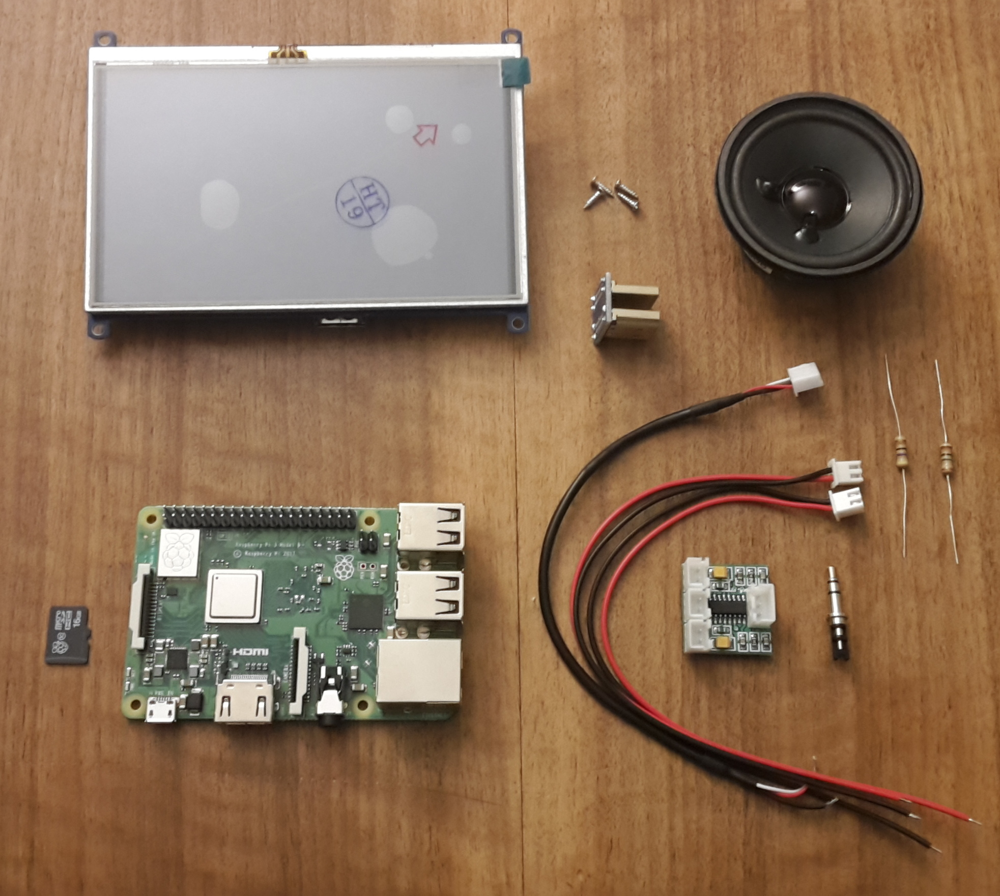
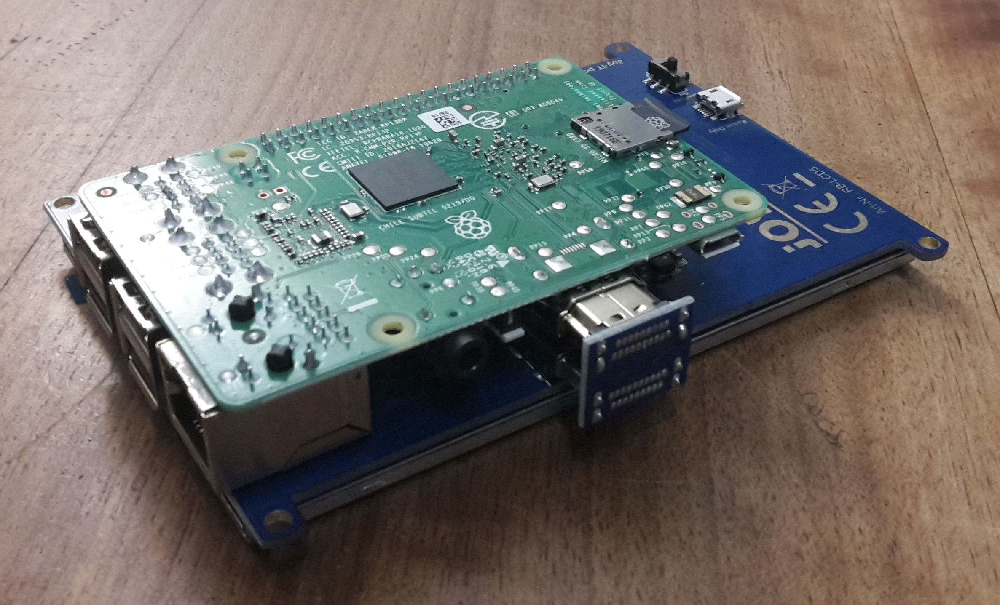
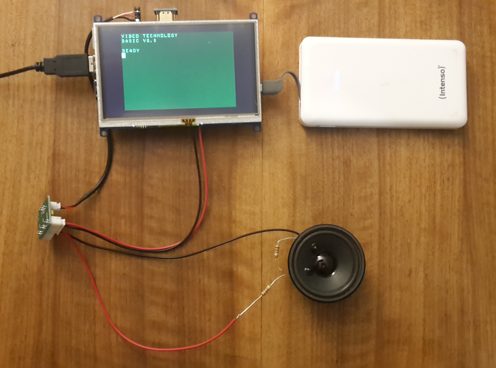
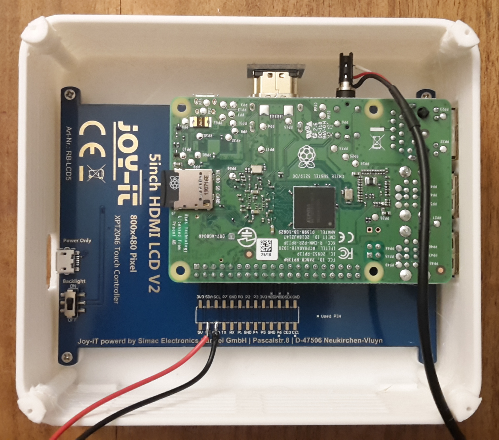
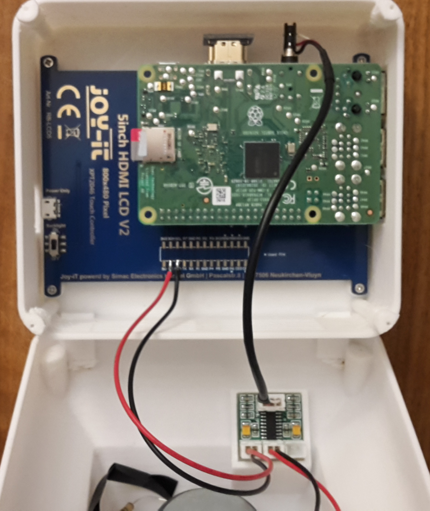

**[BACK](README.md)**
# <a name="monitor">Monitor Assembly with TFT Display, Raspberry-Pi and Speaker</a>

## Required Parts

| Part | Description |
| ------- | ------------ |
| 3D Printed parts | Case Front and Back, Front Plate (optional), holding ring for speaker, 4 rubber feet (TPU) |
| Audio Amplifier | Mini Audio Amplifier PAM8403 DC 5V |
| 3.5" Stereo plug | best use a used one since it has to be ripped apart anyway |
| Speaker | 2" / 5 cm mini speaker 3 W 4 Ohm |
| Resistors for the voltage divider : 1x 1000 kOhm, 1x 47 Ohm| This divider reduces the voltage directly at the speaker to minimize volume and amplifier noise |
| Raspberry Pi | Modell >= 3b |
| TFT-Display | JOY-iT 5“ HDMI Touchscreen Display |
| 4 screws M2 6mm | To attach the speaker within the case |
| 4 screws M2 8mm | To assemble and fasten the case |
| 4 screws M2 6mm| To attach the display |
| Double side adhesive tape | To attach the Audio Amplifier |

Attention: Other than the VZ 200 model the Monitor parts do not need to be scaled down to 70%.

## Assemble the Monitor

Attach the TFT display to the GPIO Pins of the Raspberry and then connect both parts with the HDMI bridge.

The Audio Amplifier "PAM8403" amplifies the Raspberry signal quite a bit, yet also produces a lot of noise. By inserting a voltage divider and resistors both audio volume and noise will be dampened to an acceptable level.

Solder the audio cable to the audio plug as shown here.

Power for the audio amplifier is taken from the GPIO pins of the TFT display (the display only utilizes a few Pins itself).

Here's how the completed cabeling looks like. Please pay attention to the labels on the amplifier board, those plugs must be plugged in with the correct orientation.

The VZ200 can be now run through a first test.

To avoid shortages, apply an isolating tape to the long resistor of the voltage divider. 

Attach the speaker with the 3D printed ring to the back case and fasten it with four screws. Use double side adhesive tape to attach the audio amplifier.

Then use another 4 screws to attach the TFT display with the plugged in Raspberry to the case front.

To complete the monitor interior plug in all cables to the amplifier board and assemble the two monitor parts by fastening them with 4 screws.

Glue the four monitor feet onto the bottom side of the monitor.

Then either glue the seperately printed front panel to the front or design your own one. 

Now paint the monitor to your liking. Here is an example in a 1950er retro look;

**[BACK](README.md)**
