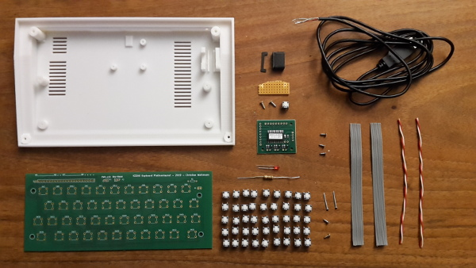
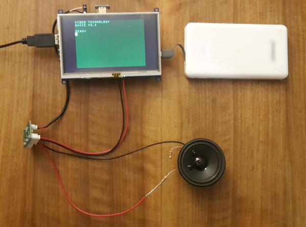
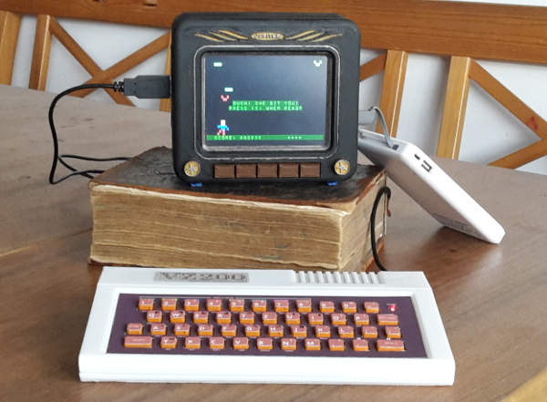

# vz200-remake
A remake of the VZ200 Color Computer (Vtech / Dick Smith 1983)

# *VZ200-remake* at the Makerfaire-Ruhr

We are pleased being part of the program of the Makerfair-Ruhr in Dortmund!

* from **28.3 to 29.3 2020** in DASA in Dortmund

During the whole fair we screw and solder on the models. You may join us and look over our shoulder or get your hands on yourself. What we produce together will be raffled off during the fair.

Whether Space-Invader or Hello World – working models of the „VZ200 Color Computer“ are ready to try. 

At these times, we dig deeper into individual topics:

* 11:00h – 3D-Design and -Printing
* 14:00h – PCB layout with KiCad
* 16:00h – Basic- and Assembler-Programming

# that's waiting for you:

* design- and printdata for ...

... a VZ200 Color Computer 70% of the original size

... a monitor with built-in TFT-display, Raspberry PI and speaker

* circuit board design and .gbr files for a full functional keyboard
* VZ200 emulator (based on 'jemu': http://jemu.winape.net) with datasette-emulation and REST-interface
* VZ200 Companion App to control your VZ200 from remote by the REST-interface
* list of all needed parts
* detailled building and installation instruction

# Impressions from the construction site
 
The VZ200 should have a fully functional rubber keyboard. We solved this with a self-designed circuit board with push buttons, on which the printed mat with rubber buttons lies, connected to an USB keyboard controller. In pieces:

Der Emulator läuft auf einem Raspberri PI 3b und einem aufgesetzten 5 Zoll HDMI-Display. Für den Sound sorgt ein kleiner Verstärkerchip. Alles zusammen wird in ein Monitorgehäuse eingebaut.
The emulator runs on a Raspberry PI 3b combined with a 5 inch HDMI display. A small amplifier chip provides the sound. Everything is built into a monitor housing.

Here is a picture of the first finished model. The source for the game is available at [the-hunter.asm](examples/the-hunter.asm), or get the .VZ-file [thehunter.vz](examples/thehunter.vz)

