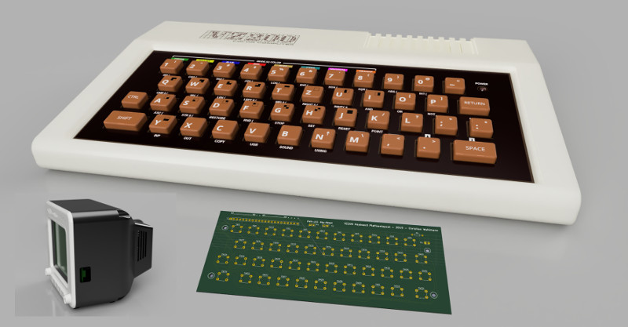

# vz200-remake
A replica of the VZ200 Color Computer (Vtech / Dick Smith 1983)

**[==>> RESOURCES & DOWNLOADS <<==](#resources-and-downloads)** 

**[@ Designing and printing the Parts](01_print.md)**

**[@ Cirquit board design and production](02_cirquitboarddesign.md)**

**[@ Assembly of the VZ200](03_assembly_vz200.md)**

**[@ Assembly of the Monitor with TFT Display, Raspberry-Pi and Speaker](04_assembly_monitor.md)**

**[@ Installation of the Raspberry Pi](05_installation.md)**

**[@ The VZ200 Emulator](06_emulator.md)**

**[@ VZ200 Companion App](apps/README.md)**

**[@ Useful Links](08_links.md)**

## Resources and downloads

Hardware
* [STL files on Thingiverse](https://www.thingiverse.com/thing:4415555)
* [3d-Model VZ200](../resources/3d-model/vz200.f3d)
* [3d-Model Monitor](../resources/3d-model/Monitor_5-Zoll.f3d) 
* [Gerber-files for the keyboard circuit board](../resources/gerber/vz200-keyboard-layout.zip)
* [graphics for the keyboard](../resources/aufkleber/Aufkleber-2x70perc.png)
* [graphics for the logo](../resources/aufkleber/logo_7x70perc_A4.png)

Software
* [JemuVZ200 Emulator V2.1](../resources/releases/JemuVZ200-2.1.zip)
* VZ200 Companion App (TODO)

Documentation and examples
* [Z80 instruction set](../resources/doc/z80.pdf)
* [VZ200 Basic instruction set](../resources/doc/VZ200-Basic.pdf)
* ["Hello World" (assembler) tutorial](../resources/doc/tutorial/hello-world-asm-tutorial.pdf)
* ["Side scrolling" (assembler) tutorial](../resources/doc/tutorial/side-scroll-asm-tutorial.pdf)
* [Tutorial presentation (LibreOffice)](../resources/doc/tutorial/VZ200-tutorial.odp)

All Sources are hosted at
* [github.com/cwahlmann/vz200](https://github.com/cwahlmann/vz200)

