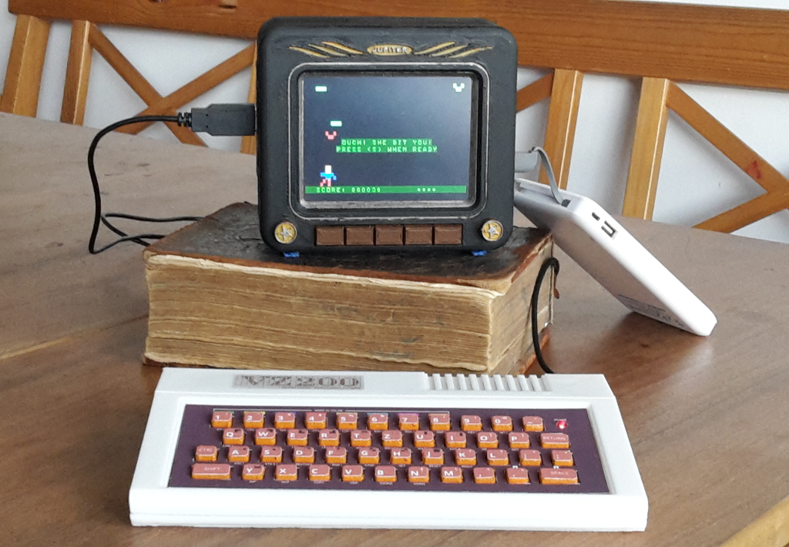

# vz200-remake
A replica of the VZ200 Color Computer (Vtech / Dick Smith 1983)

**[@ Resources and downloads](00_resource.md)**

**[@ Designing and printing the Parts](01_print.md)**

**[@ Cirquit board design and production](02_cirquitboarddesign.md)**

**[@ Assembly of the VZ200](03_assembly_vz200.md)**

**[@ Zusammenbau des Monitors mit TFT-Display, Raspberry-Pi und Lautsprecher](04_assembly_monitor.md)**

**[@ Installation des Raspberry Pi](05_installation.md)**

**[@ Der VZ200 Emulator](06_emulator.md)**

**[@ VZ200 Companion App](apps/README.md)**

**[@ Useful Links](08_links.md)**

