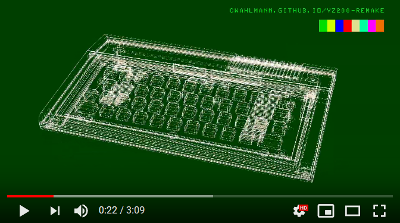
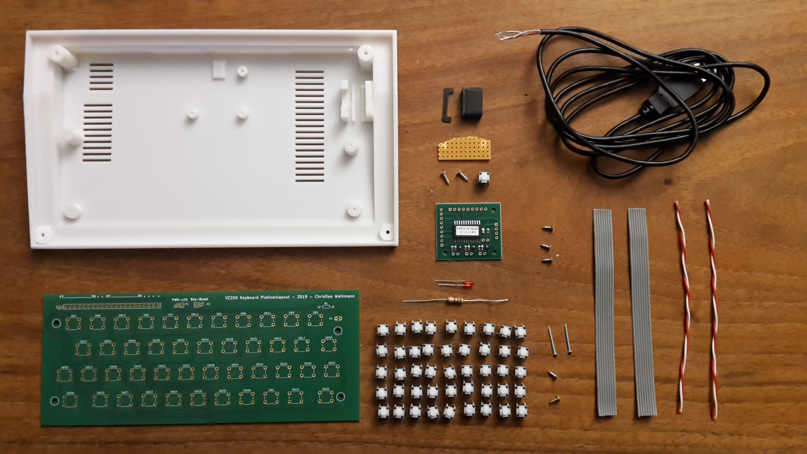

# vz200-remake
A remake of the VZ200 Color Computer (Vtech / Dick Smith 1983)

# *VZ200-remake* at the Makerfaire-Ruhr

    We are pleased being part of the program of the Makerfair-Ruhr in Dortmund.
    
    To our regret the fair has been cancelled like many other events due to the Corona crisis going on,
    though we do understand the reasoning behind this. Health comes first.  

    To make up for it we now will put online all the material we meant to present to you
    at the makerfaire. May some of you spend happy hours reprinting,
    souldering and assembling the VZ200! 
        
    If there is any chance for the faire to be held later this year, you most
    likely will find us there ;-)

Here you already find the video, that should have been running in the background of the faire:

# that's waiting for you:

* design- and printdata for ...

... a VZ200 Color Computer 70% of the original size

... a monitor with built-in TFT-display, Raspberry PI and speaker

* circuit board design and .gbr files for a full functional keyboard
* VZ200 emulator (based on 'jemu': http://jemu.winape.net) with datasette-emulation and REST-interface
* VZ200 Companion App to control your VZ200 from remote by the REST-interface
* list of all needed parts
* detailled building and installation instruction

# Impressions from the construction site
 
The VZ200 should have a fully functional rubber keyboard. We solved this with a self-designed circuit board with push buttons, on which the printed mat with rubber buttons lies, connected to an USB keyboard controller. In pieces:

The emulator runs on a Raspberry PI 3b combined with a 5 inch HDMI display. A small amplifier chip provides the sound. Everything is built into a monitor housing.

Here is a picture of the first finished model. The source for the game is available at [the-hunter.asm](../examples/the-hunter.asm), or get the .VZ-file [thehunter.vz](../examples/thehunter.vz)

